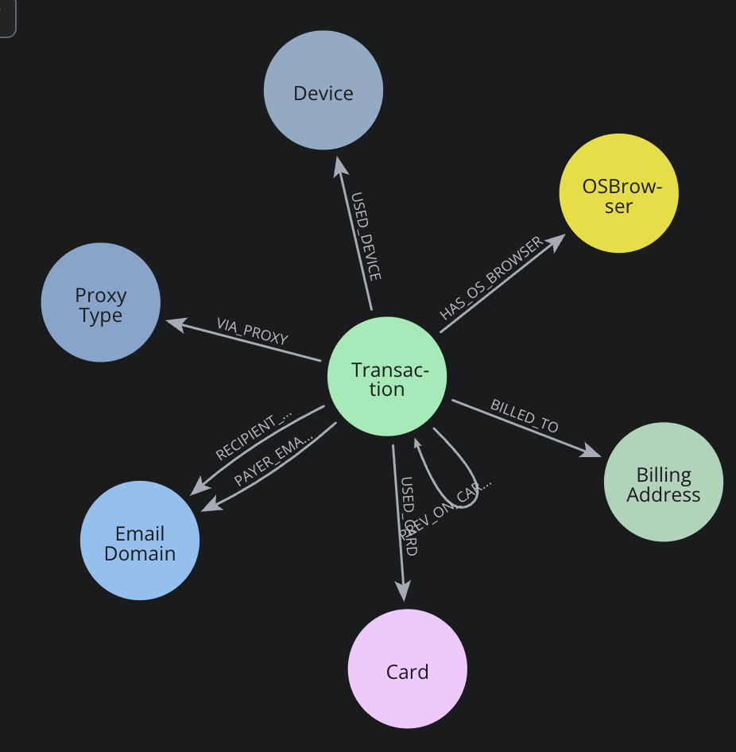

# Demo Talk Track - IEEE-CIS Fraud Detection with Neo4j

---

## Opening (1–2 min)

**The problem:**
"Credit card fraud costs the global economy over $30 billion annually. Detection is hard for two reasons: first, fraud is extremely rare - only 3.5% of transactions in this dataset. Second, traditional ML models look at each transaction in isolation. But fraud is rarely isolated."

**The dataset:**
"We're using the real IEEE-CIS Fraud Detection dataset from a major payments processor: 590,000 transactions, 394 features. It includes card attributes, billing addresses, email domains, and for 24% of transactions, device and browser information."

---

## Section 1: Why Tabular ML Falls Short (2 min)

"A traditional ML model - even a very strong one like LightGBM - gets a transaction as a row of numbers. It doesn't know that this transaction used the same card as 300 previous fraud transactions. It doesn't know this device has been flagged 50 times. That context is invisible."

**Baseline result:**
"Our tabular LightGBM baseline achieves ROC-AUC 0.92 and PR-AUC 0.60. That's genuinely strong. But watch what happens when we add graph context."

---

## Section 2: The Graph Model (3 min)

**Graph data model:**

**Open Neo4j Browser. Navigate to the database.**

"We loaded this entire dataset as a graph. Every transaction is a node. It's connected to:
- The card used (card1 - 13,553 unique cards)
- The purchaser's email domain - 60 unique domains
- The billing address - 437 unique address codes
- The device, if we have identity data - 1,457 normalized devices"

**Run Query 1 (overview stats):**
"590,000 transactions, 20,663 fraud. 1.87 million edges. The graph gives every transaction a context it didn't have before."

**Run Query 2 (top compromised cards):**
"Look at card 9633 - 742 fraud transactions. That's a card being systematically exploited. Card 9917 has a 33% fraud rate. These are compromised cards that tabular models partially detect, but the graph makes it explicit and immediately queryable."

---

## Section 3: Suspicious Patterns in the Graph (3 min)

**Run Query 3 (shared device fraud rings):**
"Here's where it gets interesting. Some specific Samsung and Huawei model fingerprints show up in 30–60% fraud rates across dozens of transactions. These are devices being used by fraud rings - not individuals."

**Run Query 6 (cluster visualization in Browser):**
"Let me show you the neighborhood around Card 9633 visually. [Run in Browser] You can see the fraud transactions radiating out from the card node, connecting through to email domains and billing addresses. This is a fraud ring made visible."

**Run Query 8 (cross-entity amplification):**
"The strongest signals come when multiple entities align. A transaction on a compromised card AND a high-fraud email domain is a much stronger signal than either alone. The graph makes these co-occurrence patterns queryable."

---

## Section 4: Graph-Enhanced ML Results (2 min)

"We turned the graph patterns into ML features:
- For each transaction: what fraction of transactions on the same card are fraud?
- What fraction on the same device are fraud?
- We also ran FastRP - a graph embedding algorithm - to give each transaction a 64-dimensional vector that encodes its position in the fraud network."

**Show the comparison table:**

| Metric | Tabular Baseline | Graph-Enhanced | Improvement |
|---|---|---|---|
| ROC-AUC | 0.9208 | 0.9441 | +2.5% |
| **PR-AUC** | **0.5966** | **0.6488** | **+8.7%** |
| F1 (fraud) | 0.5790 | 0.6157 | +6.3% |
| Precision | 0.6689 | 0.7249 | +8.4% |
| Recall | 0.5103 | 0.5351 | +4.9% |

"PR-AUC is the metric that matters - it measures fraud capture across all operating thresholds. An 8.7% improvement means substantially more fraud caught, with fewer false alarms. That's real money for a fraud team."

---

## Section 5: What Makes This Approach Powerful (1 min)

"Three things make this graph approach compelling:

1. **Explainability**: You can show an investigator exactly why a transaction was flagged - it shares a card with 742 known fraudulent transactions. That's not a black box.

2. **Network effects**: The graph catches fraud that's invisible to row-by-row models. A new account looks clean in isolation but is immediately suspicious when connected to a known fraud device.

3. **Queryability**: Any fraud analyst can write a Cypher query to investigate patterns. The graph is a shared intelligence layer, not just a model output."

---

## Honest Limitations (30 sec)

"A few things to be upfront about:
- The entity fraud rates I computed use training data - in production you'd use a rolling lookback window to avoid lookahead bias
- WCC components didn't help here - the email domain hubs connect too many transactions into one giant component
- FastRP embeddings are structural, not supervised. They amplify the signal but aren't magic
- This is a training set experiment - the Kaggle test set has no labels, so Kaggle AUC would be the true holdout test"

---

## Closing (30 sec)

"The key takeaway: tabular models and graph models aren't competitors. The graph adds a relational intelligence layer that makes every downstream model better. For fraud detection, where the enemy is organized, connected, and reusing infrastructure - the graph is not optional. It's the right tool."

---

## Backup Questions

**Q: Does the graph model always win?**
A: Not necessarily. If fraud is completely random with no entity reuse, graph features add noise. The improvement here is genuine because this dataset has real shared-identity fraud patterns. Always validate with PR-AUC on a holdout set.

**Q: How do you prevent leakage from the fraud labels?**
A: Entity fraud rates are computed on the training split only and joined to validation separately. The temporal split ensures validation transactions are always more recent than training transactions - simulating real deployment.

**Q: How scalable is this in production?**
A: Neo4j Aura handles 590K nodes and 1.87M edges comfortably. For real-time scoring, you'd precompute entity fraud rates in Neo4j and expose them via a lookup API, rather than running full graph queries per transaction.

**Q: Why FastRP and not GraphSAGE?**
A: FastRP is available natively in GDS, runs in 3 minutes on this data, and requires no training loop. GraphSAGE would allow supervised embedding with the fraud label, potentially stronger embeddings, but requires significant additional setup. FastRP is the right pragmatic choice for a first version.
