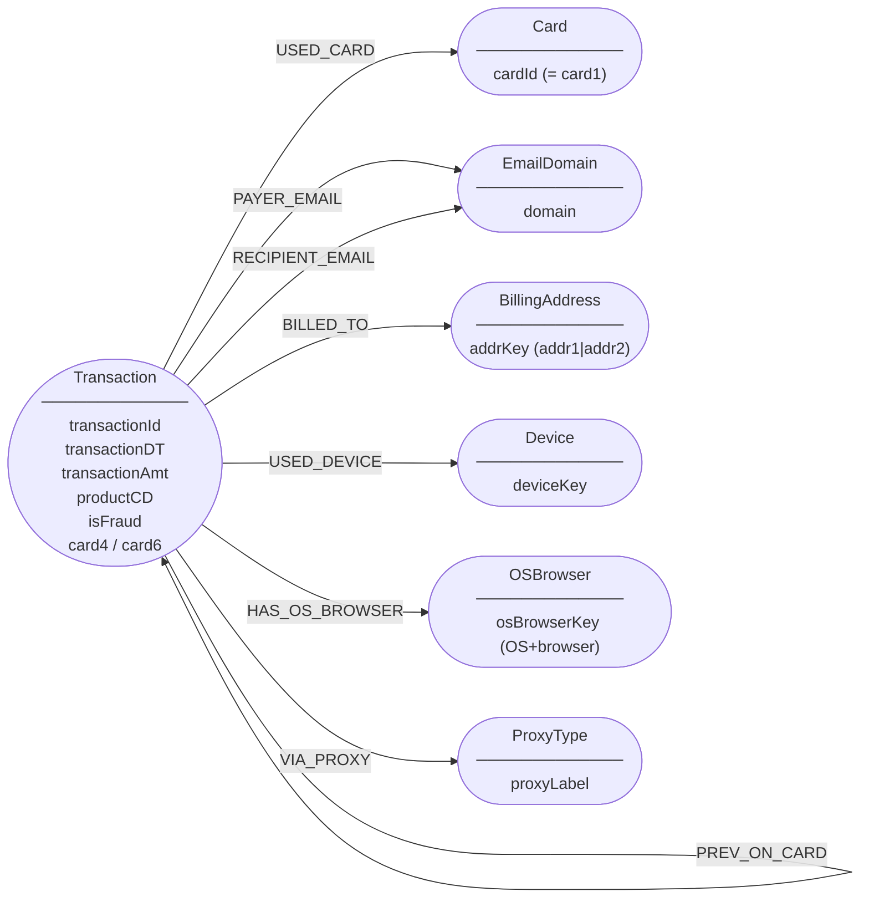

# Final Graph Model — IEEE-CIS Fraud Detection

**Chosen Model**: Model A (simple, demo-friendly)

---

## Graph Data Model

### Mermaid Diagram



---

## Node Definitions

### Transaction

Represents a single payment event. This is the primary node.

**Key**: `transactionId` (integer, from `TransactionID`)

**Properties stored on node**:

| Property | Source Column | Notes |
|---|---|---|
| `transactionId` | TransactionID | Primary key |
| `transactionDT` | TransactionDT | Seconds from reference epoch |
| `transactionAmt` | TransactionAmt | USD amount |
| `productCD` | ProductCD | W / C / H / S / R |
| `isFraud` | isFraud | 0 or 1. Only set for training data |
| `card4` | card4 | visa / mastercard / amex / discover |
| `card6` | card6 | debit / credit |
| `addr1` | addr1 | Billing region code |
| `addr2` | addr2 | Country/region |
| `dist1` | dist1 | Distance signal 1 |
| `hasIdentity` | derived | Boolean: whether identity row exists |

Note: C, D, M, V columns are intentionally left off the graph node to keep it lean. They are used only in the ML feature set.

---

### Card

Represents a payment instrument, identified by `card1`.

`card1` is the highest-cardinality card field (13,553 unique values) and behaves like a card fingerprint. Multiple transactions sharing the same `card1` are transactions using the same payment card.

**Key**: `cardId` (string, from `card1` cast to string)

**Why card1 and not a composite?** `card2`–`card5` are partial card attributes (BIN, bank, type). `card1` alone is sufficient as a card identity proxy and avoids the complexity of composite keys.

---

### EmailDomain

Represents an email domain (not a full email address — full addresses are not in the dataset).

Two relationships connect Transaction → EmailDomain:
- `PAYER_EMAIL`: the purchaser's email domain (`P_emaildomain`)
- `RECIPIENT_EMAIL`: the recipient's email domain (`R_emaildomain`)

Using a single `EmailDomain` label for both directions allows a single Cypher query to find all transactions that share any email domain.

**Key**: `domain` (string, lowercased)

**Cardinality**: 59–60 unique domains. Low enough that EmailDomain is a useful grouping node without becoming a trivial hub.

**NULL handling**: If `P_emaildomain` is NULL, do not create the relationship (do not create a NULL domain node).

---

### BillingAddress

Represents a billing region composed of `addr1` (postal/zip area) and `addr2` (country code).

**Key**: `addrKey` (string, format: `"{addr1}|{addr2}"`)

**Cardinality**: addr1 has 332 unique values, addr2 has 74. Populated combinations are far fewer than 332×74.

**NULL handling**: Only create this node when both addr1 and addr2 are non-null.

---

### Device

Represents a device fingerprint derived from `DeviceInfo`.

`DeviceInfo` contains raw device strings like "SAMSUNG SM-G892A Build/NRD90M", "Windows", "iOS Device". These need light normalization:
- Normalize to top-level device family where possible (e.g., strip build numbers)
- Keep distinct enough to be meaningful as a grouping node
- This node is only created for transactions that have a row in `train_identity`

**Key**: `deviceKey` (string, normalized DeviceInfo)

**Normalization rules**:
- Strip " Build/XXXXXXX" suffixes from Samsung model strings
- Keep "Windows", "iOS Device", "MacOS", "Trident/7.0" as-is (already canonical)
- Lowercase and strip trailing whitespace

**Cardinality**: ~500–1,000 distinct normalized device keys. Meaningful grouping.

---

## Relationships

| Relationship | From | To | Properties | Null Policy |
|---|---|---|---|---|
| `USED_CARD` | Transaction | Card | (none) | Skip if card1 is null |
| `PAYER_EMAIL` | Transaction | EmailDomain | (none) | Skip if P_emaildomain is null |
| `RECIPIENT_EMAIL` | Transaction | EmailDomain | (none) | Skip if R_emaildomain is null |
| `BILLED_TO` | Transaction | BillingAddress | (none) | Skip if addr1 or addr2 is null |
| `USED_DEVICE` | Transaction | Device | (none) | Skip if DeviceInfo is null or no identity row |

All relationships are directional: `(Transaction)→(Entity)`. This reflects the model's intent: a transaction *uses* a card, *is billed to* an address, etc.

---

## Neo4j Schema: Constraints and Indexes

```cypher
// Unique constraints (also create indexes automatically)
CREATE CONSTRAINT transaction_id IF NOT EXISTS
FOR (t:Transaction) REQUIRE t.transactionId IS UNIQUE;

CREATE CONSTRAINT card_id IF NOT EXISTS
FOR (c:Card) REQUIRE c.cardId IS UNIQUE;

CREATE CONSTRAINT email_domain IF NOT EXISTS
FOR (e:EmailDomain) REQUIRE e.domain IS UNIQUE;

CREATE CONSTRAINT billing_address IF NOT EXISTS
FOR (b:BillingAddress) REQUIRE b.addrKey IS UNIQUE;

CREATE CONSTRAINT device_key IF NOT EXISTS
FOR (d:Device) REQUIRE d.deviceKey IS UNIQUE;

// Additional index for fraud filtering
CREATE INDEX transaction_fraud IF NOT EXISTS
FOR (t:Transaction) ON (t.isFraud);

// Index for time-based queries
CREATE INDEX transaction_dt IF NOT EXISTS
FOR (t:Transaction) ON (t.transactionDT);

// Index for amount-based queries
CREATE INDEX transaction_amt IF NOT EXISTS
FOR (t:Transaction) ON (t.transactionAmt);
```

---

## Graph Statistics (Expected After Loading)

Based on training data analysis:

| Entity | Estimated Count | Notes |
|---|---|---|
| Transaction | ~590,540 | All training transactions |
| Card | ~13,553 | Unique card1 values |
| EmailDomain | ~60–70 | Unique domains (P + R combined) |
| BillingAddress | ~2,000–5,000 | Non-null addr1+addr2 combinations |
| Device | ~500–1,000 | Normalized DeviceInfo values |
| USED_CARD edges | ~590,000 | Near 1:1 (minimal card1 nulls) |
| PAYER_EMAIL edges | ~470,000 | ~80% have P_emaildomain |
| RECIPIENT_EMAIL edges | ~200,000 | ~34% have R_emaildomain |
| BILLED_TO edges | ~530,000 | ~90% have both addr fields |
| USED_DEVICE edges | ~120,000 | ~24% with identity + non-null DeviceInfo |

---

## How This Graph Supports Fraud Detection

### Shared Identity Analysis
```
(:Transaction {isFraud:1})-[:USED_CARD]->(:Card)<-[:USED_CARD]-(:Transaction {isFraud:0})
```
Find legitimate transactions sharing a card with known fraudulent transactions.

### Suspicious Reuse Patterns
```
MATCH (d:Device)<-[:USED_DEVICE]-(t:Transaction)
WITH d, count(t) AS txCount, sum(t.isFraud) AS fraudCount
WHERE txCount > 10 AND fraudCount > 3
RETURN d, txCount, fraudCount
```
Devices used in many transactions with high fraud concentration.

### Connected-Component Reasoning
Two transactions are in the same component if they share any entity (card, domain, address, or device). A large component containing many fraud-labeled transactions is a risk cluster.

### Node Embeddings (FastRP)
Project Transaction nodes with their entity connections. The embedding captures neighborhood structure: a Transaction node connected to a high-fraud card and a suspicious email domain will embed near other fraud transactions, even without the `isFraud` label being used in the embedding.
